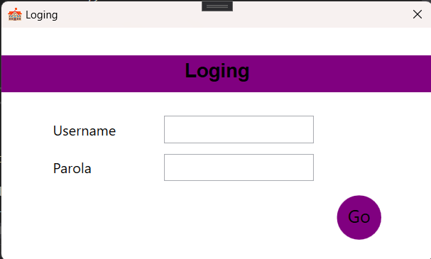
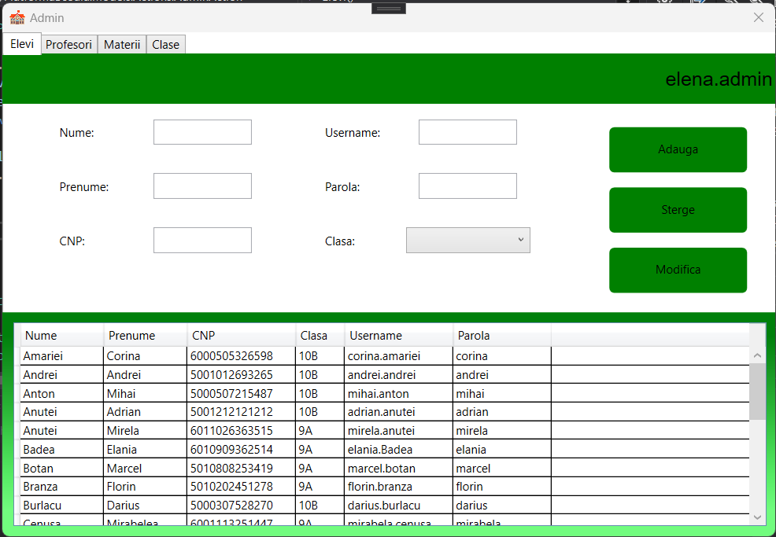
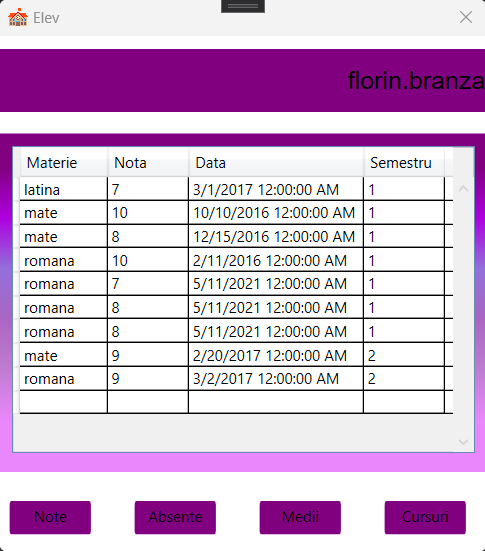

# Educational platform
An MVVM-based educational platform created with C#, WPF, and SQL Server 2017. The application's functionality is derived from the Romanian high school curriculum.

# Login
An user can log as one of the following:

* Admin
* Student
* Professor
  

# Admin

* can change, add, or remove a student, teacher, or subject.
* can change/remove the relationship that exists between a subject and a professor.
* manages the headmasters for the existing classes.

# Student

* can see own grades and attendance situations

# Professor

* can add / delete grades
* can add / motivate an absence (added by themselves)

If the currently logged-in professor also serves as the headmaster for a particular class, they will be granted access to an additional menu with the following privileges:

* viewing the class situation, including grades and attendance records.
* ability to motivate absences for any student in the class.
